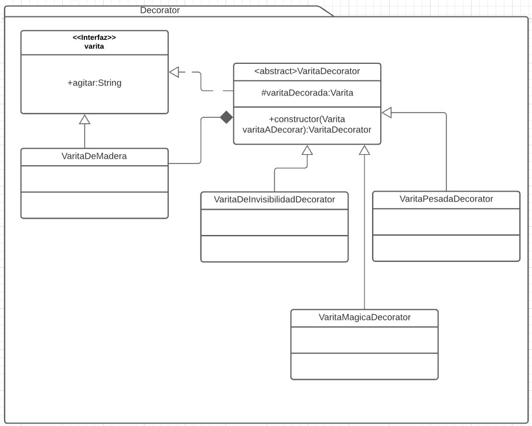

# Decorator
Es un patron estructural. [Link descripcion](https://sourcemaking.com/design_patterns/decorator)

Es una forma de extender la funcionalidad de un objeto utilizando la misma interfaz y sin usar herencia, el "Decorador" tiene una instancia del objeto a "decorar" y al llamar a sus metodos (los del decorador) este hace funcionalidad nueva antes o después de llamar al método del "decorado".

## Diagrama de clases

## SOLID
* Single responsibility

Un decorador tiene intrinsicamente una sola responsabilidad, la de agregar una pequeña funcionalidad a un objeto existente, no hay porque romper con este principio. Si se necesita más de una funcionalidad agregada a un objeto decorado esto puede implementarse perfectamente encadenando más de un decorador creando una especie de matrioska de decoradores.

* Open/Closed

Este principio se cumpliria comodamente si al momento de necesitar nueva funcionalidad se crean nuevos decoradores que la implementen en lugar de modificar el decorador original

* Liskov substitution

Cualquier decorador debe comportarse como el padre, este principio debería ser facil de cumplir bajo este patron

* Interface segregation

El decorador tiene por su naturaleza una interfaz la del objeto a decorar. Este principio se cumple

* Dependency inversion

Dado el caso de que un decorador deba instanciar o acceder a otros objetos del sistema debería cumplirse este principio ya que no hay una necesidad intrinseca para romperlo.
